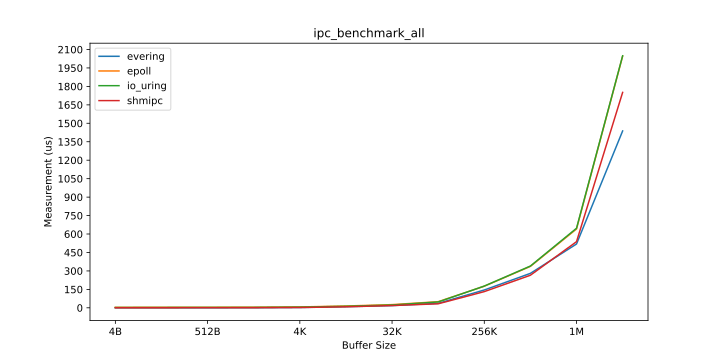
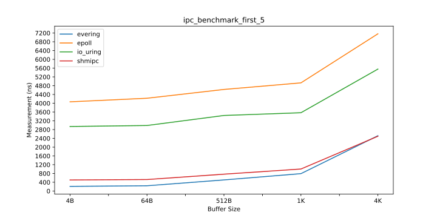
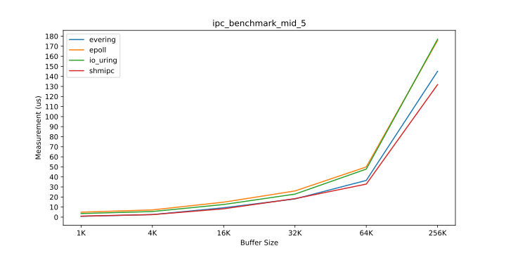
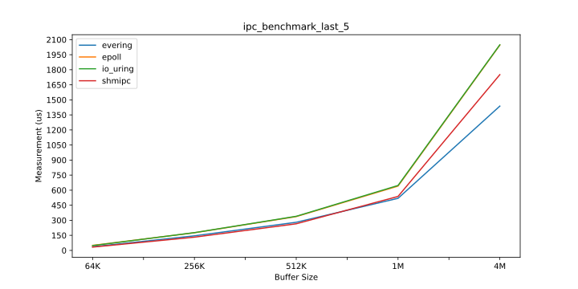

---
# See <https://marp.app/>
marp: true
theme: gaia
style: |
  :root {
    font-size: 2.5em;
  }
  section footer {
    text-align: right;
  }
  blockquote {
    font-size: 60%;
    padding: 0 0;
  }
  blockquote::after, 
  blockquote::before {
      content: '';
  }
---

<!--
_class: lead
_footer: "2025/06/21"
-->

# 基于 uring 的异步通信机制

2025 开源操作系统训练营

---

<!--
footer: "evering 异步通信框架 [1/2]"
-->

## 异步通信框架: evering

[evering](https://loichyan.github.io/openoscamp-2025s/evering) 是受 [io_uring](https://en.wikipedia.org/wiki/Io_uring) 启发的的异步通信框架，

- 🦀 基于 Rust 异步模型
- 🐧 基于共享内存
- 📡 提供双向 SPSC 消息队列
- 🎬 提供灵活的资源管理机制

---

## 双向 SPSC 消息队列

evering 使用两个单生产者单消费者并发队列进行通信，

```rust
async fn worker(queue: Uring) {
    while let Some(request) = queue.recv().await {
        spawn(async move {
            let response = serve(request).await;
            queue.send(response).await;
        });
    }
}
```

目前 evering 是遵循 thread-per-core 模型的，不同于 tokio、async-std 等使用 work-stealing 的运行时．

---

## Thread-per-core vs. Work-stealing

Thread-per-core:

- 任务不在线程间共享，不必担心同步问题
- I/O 密集型混合 CPU 密集型任务时，延迟可能较高

Work-stealing:

- 任务在线程间共享，需要考虑同步
- 当系统有空闲 CPU 资源时，能降低计算密集型任务导致的延迟

---

<!--
footer: "IPC 性能测试 [2/2]"
-->

## ipc-benchmark

针对几种 IPC 方案的性能测试，

- 基于 evering + memfd 的 IPC
- 基于 shmipc-rs + memfd 的 IPC
- 基于 epoll + UDS 的 IPC
- 基于 io_uring + UDS 的 IPC

> 1. memfd 是 create_memfd(2) 创建的匿名内存
> 2. [shmipc-rs](https://github.com/cloudwego/shmipc-rs) 是字节跳动开源的高性能 IPC 框架
> 3. UDS 是指 Unix Domain Socket
> 4. [Tokio](https://tokio.rs/) 目前的 I/O 是基于 epoll(7) 的
> 5. io_uring 使用 [tokio-uring](https://github.com/tokio-rs/tokio-uring) 的实现


---

<!--
_footer: "IPC 性能测试 [4B, 1M] [2/2]"
-->



---

<!--
_footer: "IPC 性能测试 [4B, 4K] [2/2]"
-->



---

<!--
_footer: "IPC 性能测试 [1K, 64K] [2/2]"
-->



---

<!--
_footer: "IPC 性能测试 [32K, 1M] [2/2]"
-->

